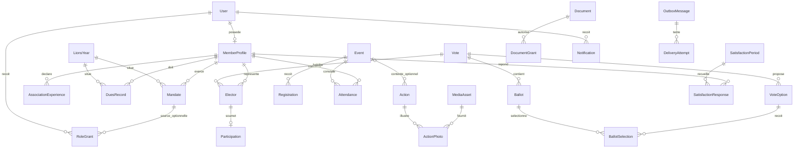

# Nouvelle architecture lionsmed.tn

**Proposition à valider humainement — 9 septembre 2026. Aucun développement engagé.**

Répertoire étudié : `/home/besbes/Documents/lionsmed`. Révision observée : `5e23e9e` (« amiloration gbt »). État initial Git : uniquement `?? mockups.zip`. Ce ZIP n’est ni modifié ni utilisé comme référence concurrente. Références frontend : les fichiers actuels de `mockups/` et le [skill lionsmed-design](../.claude/skills/lionsmed-design/SKILL.md), lu intégralement. Le commit `8e63540` reste une référence historique, pas une version à restaurer.

Ce document est le seul livrable créé. Pas d’app, code Python, migration, template Django, test, modification de configuration, CSS ou JS. L’autorisation explicite de créer ce document dans `docs/` définit le périmètre documentaire de cette session ; les restrictions du skill continuent de s’appliquer aux maquettes et au design.

## 1. Résumé de la stratégie

Construire un **monolithe Django modulaire à rendu HTML serveur**, avec **12 apps métier/techniques**, PostgreSQL dès le développement et les tests, et une conversion fidèle des maquettes en composants de templates. Les maquettes déterminent les parcours et leurs états ; les domaines métier déterminent les modèles. Aucun moteur de pages générique, SPA, microservice ou reproduction automatique de l’ancien projet.

Le centre du site public est la **mémoire des actions sociales réalisées**. Un axe oriente une action ; un événement programme un rendez-vous ; une actualité raconte la vie institutionnelle. Ce sont trois concepts distincts. Une action peut avoir un lien facultatif vers un événement, mais ne doit jamais exiger sa création préalable.

Le centre de l’espace membre est « Qu’est-ce que j’ai à faire ? ». La vue responsable expose les tâches autorisées, avec quelques indicateurs explicites. Les comptes restent personnels. Les mandats, les expériences Lions/LEO et les autorisations actuelles sont séparés.

Les décisions produit écrites sont distinguées des propositions de ce rapport. Les droits non décidés sont refusés par défaut, sans transformer ce refus provisoire en décision métier définitive. Les données de démonstration ne deviennent pas des données initiales de production.

## 2. Principes, stack et limites

### Flux de conception et d’exécution

Maquettes → parcours et contrats de données → modèles et contraintes → services et permissions → templates → tests continus. Sécurité, SEO et accessibilité accompagnent chaque étape. PostgreSQL est présent dès le premier lot, pas ajouté au dernier.

- Django **5.2.x** : `requirements.txt` déclare **5.2.17**. C’est une version déclarée, pas une vérification du serveur en production. Conserver la branche 5.2 pour ce redéveloppement ; vérifier correctifs et compatibilité Python à l’ouverture du Lot 1.
- PostgreSQL : proposer **17**, version mineure supportée au déploiement, sous réserve de disponibilité chez l’hébergeur ; même majeure en développement/CI/préproduction. Ni SQLite pour les tests de concurrence, ni bascule silencieuse SQLite si la configuration manque.
- Templates Django, CSS manuel, JavaScript vanilla, formulaires HTTP et progressive enhancement. Le serveur fonctionne sans JS ; le JS améliore filtres, confirmations et menus.
- Services transactionnels pour les mutations sensibles ; selectors/querysets pour les lectures. Forms : validation des entrées ; views : HTTP ; templates : présentation. Pas de signaux comme moteur implicite des workflows.
- Identifiants techniques privés opaques ; slugs publics stables. Les UUID ne constituent jamais une permission.
- Nouvelle structure et nouvelle base séparées du legacy. Aucun remplacement sur place des anciennes migrations ou de `AUTH_USER_MODEL` dans la base existante.

### Dépendances proposées

| Dépendance | Décision proposée | Justification |
|---|---|---|
| Django, bibliothèques standard | Oui | Authentification, forms, ORM, templates, cache, admin, sitemap, tests |
| Pilote PostgreSQL | Un seul : psycopg 3 à valider au Lot 1 | Ne pas garder simultanément deux pilotes ; le legacy utilise psycopg2-binary |
| Pillow | Oui | Décodage et réencodage des images, orientation, limites de pixels |
| django-axes | Oui, configuré et testé | Protection login ; aucune protection brute force native complète à supposer |
| django-ratelimit | Oui si backend atomique partagé validé | Contact/candidature/reset ; ne pas utiliser un compteur en mémoire par processus |
| Redis + client | Proposition pour compteurs atomiques/cache partagé | Un service d’infrastructure ; panne : politique explicite, pas de contournement silencieux des limites sensibles |
| WhiteNoise | Si statiques servis par l’application | Alternative serveur web ; jamais pour les documents privés |
| Serveur WSGI de production | Oui, selon hébergeur | Un processus web et un worker d’envoi distinct, pas `runserver` |
| django-extensions, dotenv | Développement seulement si utiles | Aucun besoin métier |
| Sauvegarde PostgreSQL native | Oui | Dumps, fichiers privés et restauration vérifiée ; django-dbbackup optionnel |
| Celery / broker de tâches | Pas initialement | Outbox PostgreSQL + worker/commande planifiée suffisent au volume attendu |
| allauth / guardian / CMS / éditeur riche | Non initialement | Pas de login social, pas de moteur ACL générique ou HTML riche requis |
| Bibliothèque MFA maintenue | À sélectionner au Lot 1 | MFA recommandé obligatoire pour les comptes privilégiés ; ne pas inventer TOTP |
| Bibliothèque cryptographique / gestionnaire de clés | Conditionnel | Seulement si la réidentification exceptionnelle est validée ; jamais de crypto artisanale |

La version exacte, la maintenance et les licences de toute nouvelle dépendance seront vérifiées avant installation. Aucune n’est installée pendant cette session.

## 3. Inventaire des maquettes et matrice maquette → backend

Inventaire des HTML actifs : **49 fichiers : 18 à la racine (16 pages + 2 alias historiques), 21 privés, 9 e-mails et leur index**. Les archives `_backup/`, rapports/captures `validation/` et outils `outils/` ne sont pas des pages produit. Les 23 fichiers de `assets/images/` et les 9 photographies sources (plus leur README) sont des candidats à réutilisation visuelle, sous réserve des droits. L’ICS de démonstration n’est pas un événement à importer.

Lecture réalisée : contenu visible des 49 HTML, champs et états, permissions `data-*`, liens/canonicals, structure des styles et comportements partagés, documentation des sources ; lecture ciblée des modèles, routes et protections legacy ; schéma et comptages SQLite en lecture seule. Ceci est un audit d’architecture, pas une nouvelle certification visuelle ou un test de sécurité en production.

Abréviations : **P** = public publié et validé ; **A** = compte actif autorisé ; **M** = membre actif (hors invité) ; **G** = permission de gestion dédiée et contrôle objet ; **N** = noindex, hors sitemap ; **I** = indexable en production validée. Les noms de views sont des contrats futurs, pas du code créé. Toutes les routes ci-dessous seront nommées dans Django.

### Pages publiques

| Maquette | View future | Modèles | Permissions | SEO | Notes |
|---|---|---|---|---|---|
| `accueil.html` | HomeView | ClubIdentity, EditorialSection, ImpactMetric, Action, NewsArticle, Event facultatif | P | I, NGO | Actions réalisées dominantes ; aucun bloc vide si aucun futur événement |
| `notre-club.html` | ClubView | ClubIdentity, EditorialSection, ClubValue, HistoryEntry, Mandate | P | I, breadcrumbs | Bureau uniquement validé et autorisé à publication |
| `nos-actions.html` | ActionListView | Action, ActionPhoto | P | I, filtre axe cadré | Quatre axes ; réalisations chronologiques, pagination serveur |
| `action-detail.html` | ActionDetailView | Action, ActionPhoto | P | I, canonical, breadcrumbs | Fiche concrète ; pas une fiche d’axe ni un événement |
| `evenements.html` | EventListView | Event | P | I si utile | Liste secondaire, lien footer/contextuel, archives possibles |
| `evenement-detail.html` | EventDetailView | Event, Registration si activée | P ; inscription A ou futur contrat | I, Event si complet | Modalités et capacité uniquement validées |
| `actualites.html` | NewsListView | NewsArticle | P | I | Vie institutionnelle ; catégorie ne remplace pas Action |
| `article-detail.html` | NewsDetailView | NewsArticle, MediaAsset | P | I, Article/NewsArticle | Auteur/date/photo réels |
| `rejoindre.html` | JoinView | EditorialSection, ImpactMetric | P | I | Parcours simple de prise de contact, pas de vote obligatoire |
| `candidature.html` | ApplicationCreateView | MembershipApplication, OutboxMessage | Anonyme, CSRF/limites | N | Accusé réception, aucune création automatique de membre |
| `contact.html` | ContactCreateView | ContactRequest, OutboxMessage, ClubIdentity | Anonyme, CSRF/limites | I GET ; succès N | Champs minimaux ; succès après persistance |
| `connexion.html` | LoginView | User, session Django | Anonyme ; compte actif au login | N | Retirer lien d’exploration sans authentification |
| `mot-de-passe-oublie.html` | PasswordResetView | User, jeton Django, OutboxMessage | Anonyme, limité | N | Même réponse pour adresse connue/inconnue |
| `mentions-legales.html` | LegalView | EditorialSection, ClubIdentity | P | I après validation | Aucun renseignement juridique inventé |
| `confidentialite.html` | PrivacyView | EditorialSection | P | I après validation | Remplacer discours « maquette » par traitement réellement déployé |
| `plan-du-site.html` | HtmlSitemapView | URLs publiées autorisées | P | I | Retirer exploration privée/e-mails ; distinct du sitemap XML |
| `home.html` | LegacyLandingRedirect | Mapping de route | Public | 301 vers `/` si route exposée | Aucun second accueil |
| `aaa.html` | LegacyLandingRedirect | Mapping de route | Public | 301 vers `/` si route exposée | Prototype, aucune nouvelle page produit |

### Pages privées

| Maquette dans `espace/` | View future | Modèles | Permissions | SEO | Notes |
|---|---|---|---|---|---|
| `tableau-de-bord.html` | DashboardView | Selectors votes, satisfaction, DuesRecord, Registration, Notification, Document | A + filtrage objet | N | À faire ; état invité distinct ; pas de chiffres fictifs |
| `profil.html` | OwnProfileView | User, MemberProfile, AssociationExperience, Mandate | A, propriétaire | N | Email exclu du form ; password via flux dédié |
| `profil-membre.html` | MemberDetailView | MemberProfile, AssociationExperience, Mandate | M + visibilité | N | Aucun profil privé sous URL publique |
| `annuaire.html` | DirectoryView | MemberProfile, RoleGrant, Mandate | M | N | Recherche/profession/rôle ; coordonnées filtrées serveur |
| `calendrier.html` | CalendarView | Event, Vote, SatisfactionPeriod, DuesRecord | A + portée propre | N | Projection d’échéances, pas table calendrier dupliquée ; export protégé |
| `votes.html` | VoteListView / BallotView / BallotConfirmView | Vote, VoteOption, Elector, Participation, Ballot | M + électeur habilité | N | Choix, récapitulatif, confirmation POST, définitif |
| `vote-creation.html` | VoteCreateView | Vote, VoteOption, Elector | G vote.create | N | Type élection = présentation de candidats, cardinalité explicite |
| `vote-suivi.html` | VoteParticipationView / VoteCloseView | Vote, Elector, Participation | G vote.manage sur ce vote | N | Qui a voté, jamais les choix ; clôture POST |
| `vote-resultats.html` | VoteResultsView | Vote, Ballot, BallotSelection | Fermé + politique résultats | N | Définir électeurs/votants/membres destinataires ; voir §13 |
| `satisfaction.html` | SatisfactionSubmitView | SatisfactionPeriod, SatisfactionResponse | M + période ouverte | N | Une réponse, note 1–5, commentaire facultatif |
| `satisfaction-resultats.html` | SatisfactionResultsView | SatisfactionPeriod, agrégats de Response | G satisfaction.results | N | Masquage petits effectifs ; commentaires non nominatifs |
| `documents.html` | DocumentListView / DocumentCreateView | Document, DocumentGrant, MediaAsset | A + ACL ; G pour dépôt | N | Liste filtrée avant recherche/comptage |
| `document-detail.html` | DocumentDetailView / DocumentDownloadView | Document, MediaAsset, DocumentGrant | Même ACL que liste | N + en-tête fichier | Un invité explicitement autorisé doit aussi accéder au détail |
| `notifications.html` | NotificationListView / NotificationReadView | Notification | A, destinataire uniquement | N | Lecture/non-lecture POST, pas effet de bord d’un GET |
| `cotisations.html` | DuesView / DuesManageView | DuesRecord, DuesChange, LionsYear | Personnel M ; G gestion | N | Pas de paiement en ligne ni montant par défaut |
| `presences.html` | AttendanceView / AttendanceRecordView | Event, Attendance, LionsYear | Personnel M ; G saisie | N | Présent/Absent/Excusé ; distinct de RSVP |
| `responsables.html` | ManagementDashboardView | Selectors par permission, Notification | G pilotage | N | « À traiter » ; chacun voit seulement ses capacités |
| `membres.html` | MemberManagementView / MandateManageView | User, MemberProfile, Mandate, RoleGrant, LionsYear | G séparées | N | Consulter ≠ accorder un rôle ; délégation restreinte |
| `contenu-public.html` | ContentWorkspaceView + éditeurs typés | Action, NewsArticle, Event, EditorialSection, Mandate | publication centrale | N | Un point d’entrée, plusieurs vrais forms métier |
| `statistiques.html` | ManagementStatisticsView | Agrégats votes/dues/attendance par année | G statistics.view | N | Aucun modèle KPI universel, définitions documentées |
| `audit.html` | ExceptionalAuditView | AuditEvent, ExceptionalAccess | SUPER + réauthentification | N | Pas de révélation tant que décision produit non validée |

### E-mails

Aucune URL publique de prévisualisation en production. Les vues mentionnées sont des rendus internes pour le worker et, en préproduction protégée, pour validation graphique.

| Maquette dans `emails/` | View/rendu futur | Modèles | Permissions | SEO | Notes |
|---|---|---|---|---|---|
| `index.html` | EmailPreviewIndex, hors production | Aucune donnée réelle | Technique préproduction | N | Catalogue de validation seulement |
| `rappel-j7.html` | EventReminderJ7Template | Event, Registration, OutboxMessage | Destinataires autorisés | Sans objet | Clé unique événement/version/date/destinataire/J7 |
| `rappel-j1.html` | EventReminderJ1Template | Event, Registration, OutboxMessage | Idem | Sans objet | Annulation/replanification vérifiée à l’envoi |
| `importante.html` | ImportantNotificationTemplate | Notification, OutboxMessage | Destinataire | Sans objet | Contenu minimal, CTA interne contrôlé |
| `ouverture-vote.html` | VoteOpenedTemplate | Vote, Elector, OutboxMessage | Électeurs figés | Sans objet | Ne contient aucun jeton permettant de voter sans connexion |
| `resultats-vote.html` | VoteResultsTemplate | Vote, OutboxMessage | Destinataires politique validée | Sans objet | Après clôture, lien privé, aucune identité/choix |
| `satisfaction.html` | SatisfactionOpenedTemplate | SatisfactionPeriod, OutboxMessage | Membres habilités | Sans objet | Période réellement ouverte, pas date de démonstration |
| `candidature.html` | ApplicationReceiptTemplate | MembershipApplication, OutboxMessage | Adresse saisie, anti-abus | Sans objet | Reçu, pas admission |
| `mot-de-passe.html` | PasswordResetEmailTemplate | User, jeton Django, OutboxMessage | Compte éligible | Sans objet | Usage unique, expiration, jamais journalisé |
| `document.html` | DocumentNotificationTemplate | Document, Notification, OutboxMessage | ACL revérifiée | Sans objet | Pas de pièce jointe privée automatiquement |

### Écarts et besoins non dessinés

1. **District** : l’appellation validée est « District 414 Tunisie » ; le skill et les pages du runtime doivent utiliser cette forme.
2. **Axe/cause** : l’accueil montre une action « Santé oculaire » alors que quatre axes seulement sont autorisés. Conserver une cause mondiale secondaire possible, sans créer un cinquième axe ; classement de cette action dans un axe à confirmer.
3. **Actions** : détail encore générique avec « modalités de participation ». Adapter plus tard le contenu validé au bilan d’une réalisation sans imposer un événement préalable.
4. **DIRECTEUR** : certaines pages lui accordent gestion/supervision, mais la décision actuelle demande confirmation de ses droits. Les marqueurs de maquette sont des indices UX, pas une délégation définitive.
5. **Audit** : texte exige une justification ; champ « motif détaillé » facultatif. Backend cible : motif obligatoire, contrôle renforcé. Réidentification séparément décidée.
6. **Documents invité** : liste autorise les invités ciblés ; détail les exclut globalement. Cible : même permission objet pour liste, détail, fichier et notification.
7. **Mandats** : le sélecteur inclut SUPER_ADMIN/INVITE comme fonctions. Cible : distinguer adhésion, mandat institutionnel et privilège technique ; pas d’escalade depuis ce formulaire.
8. **Satisfaction** : horaire exact non confirmé malgré un exemple 0 h. Ne pas déduire l’horaire du texte fictif du dashboard.
9. **Cotisations** : années calendaires dans un tableau du dashboard, Années Lions ailleurs. Aucune conversion par simple renommage.
10. **Résultats votes** : pages parlent tantôt de « votants », tantôt d’accès de tous les membres. Audience à arbitrer.
11. **Écrans à compléter pendant les lots** : réinitialisation avec jeton, activation du compte, confirmation/succès/erreurs, changement d’email contrôlé, clôture explicite, gestion candidatures/contact, saisie cotisation, édition/suppression parcours, révocation rôle, gestion année. Composer avec les composants existants ; ne pas inventer de nouveau design ni de workflow non validé.
12. `mockups/README.md` qualifie encore `prive.css` de simple repère : le fichier contient désormais la densification. L’intégration suivra les assets effectivement chargés, pas cette description devenue partiellement obsolète.

## 4. Parcours publics

Découverte → Notre Club / actions réalisées → détail factuel → rejoindre ou contacter. La home donne présence aux réalisations et à la vie du club, jamais à une obligation d’événement futur. Si aucune action validée n’existe, conserver l’introduction institutionnelle utile, sans carte fictive. Si aucune actualité ou aucun événement futur n’existe, omettre le bloc correspondant.

Navigation exacte : **Accueil · Notre Club · Nos Actions · Nous rejoindre · Contact · Se connecter**. Événements et Actualités restent accessibles au footer et par liens contextuels. Aucun sous-menu/recherche globale supplémentaire.

Les filtres de listes utilisent GET, paramètres bornés, pagination et lien de réinitialisation. Les formulaires utilisent POST/CSRF, erreurs accessibles et pattern POST → redirect → GET après succès. Une soumission n’ajoute jamais un compte automatiquement. Les visiteurs ne voient ni données privées ni prévisualisations métier.

Sfax est l’ancrage du club, pas une frontière de service. Lieux d’actions libres et validés, sans contrainte `ville = Sfax`. Les quatre priorités restent Diabète, Environnement, Humanitaire et Jeunesse.

## 5. Parcours privés

Connexion → tableau de bord filtré → tâche → confirmation si sensible → résultat persistant. Chaque retour et CTA utilise la même politique d’accès que la vue destination.

- Profil personnel : modifier nom/prénom/téléphone/profession/bio/photo/visibilité, gérer le parcours ; email affiché mais non accepté en écriture depuis ce formulaire.
- Annuaire : recherche, profil, expériences et mandats publiables aux membres ; coordonnées explicitement partagées seulement.
- Calendrier : rendez-vous visibles et échéances propres, export ponctuel ICS/Google/Outlook ; aucune synchronisation OAuth ou abonnement privé public initial.
- RSVP : confirmation d’intention de participer, distincte de la présence constatée. Pas de QR code.
- Votes : l’électeur voit un scrutin réellement ouvert, vérifie, confirme, puis ne peut plus réviser son bulletin.
- Satisfaction : note et commentaire facultatif ; reçu et état déjà répondu gérés serveur.
- Documents : recherche/détail/téléchargement selon ACL ; aucune fuite par nombre de résultats.
- Gestion : les actions disponibles proviennent de capacités, pas d’une hiérarchie numérique de rôles. Consulter des membres ne donne pas la capacité d’accorder SUPER_ADMIN.

Tous les sélecteurs de rôle/état, compteurs fictifs, dates de démonstration, liens d’exploration et scripts de faux envoi sont exclus de la production. Une query string `?role=SUPER_ADMIN` n’a aucun effet sur les droits.

## 6. Architecture d’apps proposée

### Options comparées

| Option | Avantage | Limite | Décision |
|---|---|---|---|
| 4 apps : identité, site, espace, infrastructure | Peu de répertoires | « espace » concentre vote, finance, fichiers et permissions ; tests couplés | Écartée |
| 12 apps par domaines cohérents | Responsabilités testables, migrations lisibles, sous-domaines sensibles isolés | Discipline sur dépendances et services nécessaire | **Retenue** |
| 17–20 apps séparant chaque écran/fonction | Petits fichiers | Fragmentation, dépendances inutiles, apps KPI/galerie/calendrier redondantes | Écartée |

### Les 12 apps

| App | Responsabilité | Modèles principaux | Dépendances métier |
|---|---|---|---|
| `accounts` | Identité, authentification, changement email | User, EmailChangeRequest | Aucune dépendance métier sortante |
| `members` | Profil, parcours, candidature | MemberProfile, AssociationExperience, MembershipApplication, ApplicationNote | accounts, core |
| `governance` | Années, mandats, attributions de rôles | LionsYear, ClubState, Mandate, RoleGrant | accounts, members |
| `service_actions` | Mémoire des réalisations | Action, ActionPhoto | governance, core |
| `editorial` | Institution, actualités, SEO public | ClubIdentity, EditorialSection, ClubValue, HistoryEntry, ImpactMetric, NewsArticle, Redirect | accounts, governance, core |
| `agenda` | Rendez-vous, inscriptions, présences | Event, Registration, Attendance | accounts, members, governance, core |
| `voting` | Scrutins, électeurs, bulletins | Vote, VoteOption, Elector, Participation, Ballot, BallotSelection | accounts, members, governance, core |
| `satisfaction` | Périodes et réponses | SatisfactionPeriod, SatisfactionResponse | members, governance, core |
| `documents` | Bibliothèque et autorisations fichiers | Document, DocumentGrant | accounts, governance, core |
| `dues` | Cotisations déclaratives et corrections | DuesRecord, DuesChange | members, governance, core |
| `communications` | Notifications, contact, envoi fiable | ContactRequest, Notification, OutboxMessage, DeliveryAttempt | accounts, core ; événements de domaine typés |
| `core` | Infrastructure transverse bornée | MediaAsset, AuditEvent, ExceptionalAccess, LegacyImportRecord | Références utilisateur via settings, sans services métier |

Pas d’app dashboard, statistiques, galerie, commissions ou paiement. Le dashboard est une composition de selectors ; statistiques = lectures agrégées ; galerie d’action = ActionPhoto ; présence appartient à agenda. Les constantes des quatre axes vivent dans `service_actions`, les textes institutionnels restent dans editorial. `core` n’accueille ni vues métier ni modèle universel de contenu.

### Dépendances et permissions

Les services ne s’appellent pas en cercle. L’orchestration (par exemple admission → compte/profil) est explicitement dans le domaine initiateur. Les notifications reçoivent un événement métier minimal via outbox, sans importer le service initiateur. Les lectures du dashboard sont assemblées au niveau présentation, pas dans `User`.

API centrale envisagée : `can(actor, capability, obj=None, at=...)`, `require(...)`, `scope(actor, capability, queryset)`. Registre de capacités et fonctions de politiques par domaine, avec lecture des grants centralisée. Le module technique de dispatch n’importe pas les views. Les domain policies font les contrôles métier ; templates et services appellent le même contrat. Les FKs peuvent référencer un modèle sans imposer un appel de service inverse.

## 7. Schéma cible des modèles

### Conventions communes

C’est un schéma conceptuel, pas des modèles Python. Chaque ligne indique les champs significatifs, relations, contraintes, index et exposition. Les PK internes sont UUID (ou bigint purement interne si aucun besoin d’exposition), jamais une permission. Toute FK a un index par défaut ; ne pas créer un second index identique. `U` = unique ; `C` = check de ligne ; `I` = index supplémentaire ; `S` = invariant garanti par service transactionnel ; `T` = trigger/contrainte PostgreSQL dédiée si nécessaire. Tous les champs sensibles sont exclus des logs de formulaires.

Dates/heures stockées avec fuseau (UTC), affichées en `Africa/Tunis`. Dates sans heure pour un fait connu seulement au jour. Les périodes sont semi-ouvertes `[début, fin)` et documentées. FKs d’historique : PROTECT ou anonymisation contrôlée, jamais suppression en cascade aveugle. Auteurs éditoriaux : SET_NULL si la signature publique n’est plus maintenue. Données de secrets : hachées/chiffrées selon usage, jamais en clair dans AuditEvent.

### Identité, adhésion, gouvernance

| Modèle | Responsabilité / champs | FK / M2M | Contraintes | Index utiles | Exposition |
|---|---|---|---|---|---|
| User | Compte : email, email_normalized, nom, prénom, hash password, active, email_verified_at, security_version, dates | Auth Django, pas de role courant dupliqué | U email_normalized ; non vide ; normalisation identique login/reset/import ; flags staff distincts des rôles | email unique ; active si utile | Privé |
| EmailChangeRequest | Changement contrôlé : nouvel email normalisé, token_hash, expires_at, completed_at, revoked_at, motif | user, requested_by → User | U token_hash ; une demande pendante par user ; S unicité email à finalisation, réauthentification | user+created_at, expires_at | Restreint |
| MemberProfile | Profil : téléphone, profession, bio, joined_on nullable, membership_status, coordonnées masquées/partagées, publication portrait autorisée | O2O User ; photo → MediaAsset facultative | U user ; C statuts autorisés ; S image privée par défaut | profession, statut ; recherche nom via User | Privé ; projection publique séparée |
| AssociationExperience | Mini-CV : réseau Lions/LEO, club, fonction libre, district, début/fin au mois, description, réalisations, ordre | profile | C fin ≥ début si présente ; réseau fermé ; aucun lien à RoleGrant | profile+début | Annuaire autorisé |
| MembershipApplication | Demande : champs du formulaire, statut, consentement/notice_version, dates de suivi, résultat nullable | assigned_to → User ; converted_user → User facultatif | Pas d’unicité email à vie ; U clé soumission ; C statut ; S conversion unique et procédure validée | statut+created_at, email_normalized | Restreint |
| ApplicationNote | Suivi interne : texte borné, étape, date | application ; author → User | Ajout daté ; pas de changement silencieux de décision | application+created_at | Responsables habilités |
| LionsYear | Période annuelle : label dérivé, starts_on, ends_on exclusif, archived_at | Référencée par domaines | U starts_on ; C début < fin ; exclusion des plages qui se chevauchent ; S dates conventionnelles validées | plage GiST | Interne, libellé publiable |
| ClubState | Pointeur vers année sélectionnée | active_year → LionsYear | Singleton PK fixée + C ; FK PROTECT ; S activation atomique | PK seule | Interne |
| Mandate | Historique institutionnel : fonction, dates, état validé, publication/ordre, référence de validation | profile, lions_year, validated_by | C début < fin ; S inclusion année ; exclusions de chevauchement pour fonctions uniques après validation de cette règle | year+fonction, profile+début | Privé ; projection publique validée |
| RoleGrant | Autorisation personnelle : rôle, starts_at, ends_at, revoked_at, motif | user, granted_by ; source_mandate facultatif | C rôle parmi sept ; C fin > début ; exclusion grants effectifs incompatibles ; S délégation/retour MEMBRE ; aucune déduction depuis CV | user+période, rôle+fin | Restreint |

Proposition simple : un rôle effectif à un instant, plus statut d’adhésion ; MEMBRE/INVITE sont les rôles de base issus de grants explicites. Un mandat n’attribue pas à lui seul un grant. SUPER_ADMIN n’est pas une fonction du bureau. Multi-rôles simultanés : non requis par les maquettes, à reconsidérer uniquement sur besoin confirmé.

### Public, médias et agenda

Champs éditoriaux communs (convention réutilisée, pas une table polymorphe) : titre, statut `DRAFT/REVIEW/PUBLISHED/ARCHIVED`, publication_at, updated_at, created_by/updated_by, validation/source, slug stable si page individuelle, meta_title/meta_description, social_image facultative. `public()` exige publication validée et date échue. Publication et archivage passent par un service.

| Modèle | Responsabilité / champs | FK / M2M | Contraintes | Index utiles | Exposition |
|---|---|---|---|---|---|
| MediaAsset | Original privé : clé stockage, type, MIME vérifié, taille, sha256, dimensions, scan_status, droits/provenance, dérivés autorisés | uploaded_by ; pas de GenericFK propriétaire | U storage_key ; C tailles positives ; S promotion publique après validation ; originaux non publics | sha256, scan_status+created_at | Privé ; dérivés sélectionnés publics |
| Action | Réalisation : champs éditoriaux, performed_on, lieu/ville/pays, résumé/contenu, axe parmi 4, causes secondaires optionnelles, partenaires validés texte, bénéficiaires nullable, source/date de validation | lions_year facultatif ; event facultatif ; cover → MediaAsset | U slug ; C bénéficiaires ≥ 0 si renseignés ; C axe fermé ; S réalisation/date/lieu requis avant publication, pas de date future pour « réalisée » | statut+performed_on, axe+performed_on | P seulement |
| ActionPhoto | Galerie ordonnée : légende/alt factuels, ordre, autorisation | action, asset | U action+asset ; U action+ordre ; S droits et contexte | action+ordre | P si action et asset autorisés |
| NewsArticle | Actualité institutionnelle : champs éditoriaux, résumé, corps, catégorie fermée initiale, auteur affichable optionnel | author → User facultatif ; image → MediaAsset ; action liée facultative | U slug ; S date/source/visibilité auteur vérifiées | statut+published_at, catégorie+published_at | P |
| ClubIdentity | Identité centrale : nom, ancrage, district, affiliation, devise, contacts/liens validés, statut juridique si validé | logo/social_image → MediaAsset si nécessaire | Singleton PK fixée ; aucune valeur factuelle non vérifiée par défaut | PK seule | Projection validée P |
| EditorialSection | Contenu de rubriques connues : clé, titre, paragraphes, statut, source/validation | updated_by ; image facultative | U clé ; clés autorisées en code ; pas de HTML/layout arbitraire | clé unique | P |
| ClubValue | Valeur : titre, texte, ordre, validation | updated_by | U clé ; S publication validée | ordre | P |
| HistoryEntry | Jalon documenté : date ou année connue, titre, récit, source, validation | updated_by | C précision de date cohérente ; S pas de date fictive | année/date, ordre | P |
| ImpactMetric | Chiffre public : clé/unité, valeur, période début/fin, source, validated_at | lions_year facultatif ; validated_by | C valeur ≥ 0, début ≤ fin ; U clé+période ; S validation avant affichage | clé+fin | P validé uniquement |
| Redirect | Redirection éditoriale : ancien chemin, destination interne, état | pas de GenericFK | U ancien chemin ; S absence boucle/chaîne et cible autorisée | chemin unique | HTTP public |
| Event | Rendez-vous secondaire : titre, description, début/fin, lieu, catégorie réunion/rencontre/formation/autre, visibilité, publication, inscription activée, capacité nullable, version calendrier | lions_year facultatif, organizer → User, image facultative | U slug ; C fin > début ; C capacité > 0 si présente ; S pas de type Action sociale | visibilité+début, year+début | Public ou privé |
| Registration | RSVP membre : statut intention `PENDING/CONFIRMED/CANCELLED`, dates | event, profile | U event+profile ; S capacité sous verrou Event si utilisée | profile+statut | Personnel/gestion |
| Attendance | Présence constatée : PRESENT/ABSENT/EXCUSED, recorded_at, motif borné facultatif | event, profile, recorded_by | U event+profile ; C statut fermé ; S événement pertinent et année résolue depuis Event | profile+event, event+statut | Personnel/gestion |

Pas de modèle Partner initial tant qu’aucune réutilisation structurée n’est demandée ; un texte de partenaires validé suffit. Pas de table Axis administrable permettant d’ajouter un cinquième axe. Les descriptions des quatre priorités restent éditables dans des rubriques fixes. Les causes mondiales ne remplacent pas l’axe.

### Votes, satisfaction, documents, cotisations et communication

| Modèle | Responsabilité / champs | FK / M2M | Contraintes | Index utiles | Exposition |
|---|---|---|---|---|---|
| Vote | Scrutin : titre/description, opens_at/closes_at, statut, mode, min/max choix, blanc autorisé, règle éligibilité figée/version, closed_at/by | responsible → User ; lions_year facultatif | C ouverture < fermeture, min ≥ 1, max ≥ min ; S options/électeurs figés à ouverture | statut+closes_at | Électeurs/gestion |
| VoteOption | Choix ou candidat : libellé, présentation figée, ordre, photo autorisée, candidat associé facultatif | vote ; candidate_profile facultatif ; asset facultatif | U vote+ordre ; S non modifiable après ouverture | vote+ordre | Électeurs |
| Elector | Population figée : éligibilité, référence de règle/version | vote, profile | U vote+profile ; S invité exclu à constitution ; changements exceptionnels tracés | profile+vote | Gestion ; soi-même |
| Participation | Preuve qu’un électeur a envoyé : état soumis, horodatage à précision maîtrisée | O2O Elector ; **aucune FK Ballot** | U elector ; pas de choix ou hash de choix | elector unique | Responsable/soi-même |
| Ballot | Bulletin définitif : identifiant aléatoire, vote, blanc | vote ; **pas de membre, IP, user-agent ou timestamp précis** | C blanc booléen ; S/T insertion définitive ; pas de mise à jour/suppression normale | vote | Dépouillement agrégé |
| BallotSelection | Choix du bulletin | ballot, option | U ballot+option ; T option du même vote ; T cardinalité/blanc à validation différée ; refus mutations après insertion | option, ballot | Agrégation uniquement |
| SatisfactionPeriod | Période : mois, opens_at/closes_at, timezone, règle/version, état configuré | lions_year | U mois ; C ouverture < clôture ; S mois et année cohérents | closes_at, year+mois | Membres/gestion |
| SatisfactionResponse | Réponse : note 1–5, commentaire facultatif, submitted_at | period, profile | U period+profile ; C note 1..5 ; S période ouverte, non-réponse précédente | period+note | Accès individuel interdit hors politique ; agrégats habituels |
| Document | Métadonnées : titre, catégorie dont District, auteur/date, visibilité, statut, description | asset privé, author, lions_year facultatif | C catégories/visibilités connues ; S fichier sain requis à disponibilité | catégorie+date, visibilité+date | ACL privée |
| DocumentGrant | Exception d’accès nominative, notamment invité : expires_at facultatif | document, user | U document+user ; S gestion restreinte et expiration | user+document | Restreint |
| DuesRecord | Cotisation annuelle : statut `TO_REGULARIZE/PAID`, amount nullable, currency TND si montant connu, paid_on nullable | profile, lions_year | U profile+year ; C montant ≥ 0 si présent ; S transition tracée, pas d’échéance automatique inventée | year+statut | Personnel/gestion |
| DuesChange | Historique : ancien/nouveau statut, montant/date corrigés, motif, date | dues_record, actor | Append-only ; motif obligatoire pour correction | record+created_at | Gestion autorisée |
| ContactRequest | Message : nom/email, objet enum, message borné, état traitement, date, notice_version | assigned_to facultatif | U clé soumission ; C objet/statut ; pas d’unicité email | statut+created_at | Responsables habilités |
| Notification | Message in-app : catégorie, titre, extrait minimal, target_kind/target_id validés, created_at, read_at | recipient → User | U recipient+event_key ; S cible résolue/permission revérifiée | recipient+read_at+created_at | Destinataire seul |
| OutboxMessage | Intention durable : event_key, canal, destinataire, template, contexte minimal, état, available_at, lease, attempts, provider_id | user facultatif ; référence métier typée | U clé idempotence ; C états ; S réservation worker | état+available_at | Worker restreint |
| DeliveryAttempt | Tentative : début/fin, code statut, erreur expurgée, identifiant fournisseur | outbox | Pas de corps/secret dans log ; ajout seulement | outbox+date | Technique |
| AuditEvent | Trace sensible : acteur, capacité, objet typé/id, résultat, date, motif, changements expurgés, request_id | actor nullable avec identifiant pseudonymisé stable | Append-only pour rôle SQL applicatif ; pas de bulletin/commentaire/password | objet+date, actor+date, capacité+date | Sécurité restreinte |
| ExceptionalAccess | Demande motivée : périmètre, objet, motif obligatoire, état, expires_at, approbation, used_at | requester, approver ; audit event | C expiration ; S réauth/MFA, portée/durée bornées, pas auto-autorisation implicite | état+expires_at | SUPER, processus validé |
| LegacyImportRecord | Provenance : source snapshot, table, PK legacy, cible type/id, hash source, batch, état/rejet | aucun lien à base legacy | U source+table+PK ; S import idempotent et journalisé | batch+état | Technique |

**Extension conditionnelle uniquement** : `BallotAuditEnvelope` relierait Participation et Ballot via une correspondance chiffrée sous clé distincte, avec key_id, contrôle d’intégrité et conservation définie. Elle n’appartient pas au socle recommandé tant que le produit n’a pas choisi une confidentialité réidentifiable. Son modèle exact et le découpage des accès SQL devront être validés avant le lot Votes ; aucun lien en clair ajouté « au cas où ».

## 8. Relations entre modèles



Ce diagramme illustre les relations principales ; le dictionnaire §7 fait foi pour les champs/FKs omis. L’absence de relation Participation → Ballot est intentionnelle. Ne pas confondre absence de lien applicatif et anonymat cryptographique face à un administrateur de base.

## 9. Année Lions, mandats et rôle effectif

Proposition calendaire : **1er juillet au 1er juillet suivant, borne de fin exclusive**, à confirmer par le club avant données initiales. Le libellé 2026–2027 est dérivé, pas saisi librement. Une année passée peut rester sélectionnable pour les rapports, sans devenir source de droits courants.

`ClubState.active_year` désigne la période de travail institutionnelle. Une seule ligne autorise un pointeur unique ; la validité temporelle se vérifie au service et par contrôle de cohérence planifié. Les permissions évaluent les dates effectives de RoleGrant, jamais simplement `active_year` ni le filtre d’année choisi dans l’interface.

Attribution : responsable autorisé → personne → fonction institutionnelle → Année Lions/période → validation → mandat enregistré. Un service séparé accorde un grant courant/futur si le délégant a cette capacité. Modifier un historique n’élève aucun droit.

À l’échéance, le grant expire d’après l’horloge serveur même si le scheduler est indisponible. Retour MEMBRE seulement si le profil demeure membre actif ; un compte suspendu n’est pas réactivé. La mutation est journalisée et les caches de permissions invalidés. SUPER_ADMIN et DIRECTEUR ne sont pas automatiquement les successeurs d’un mandat passé.

Dates de mandats intra-annuels, remplacement temporaire, cumul et unicité d’un président/secrétaire par période : **À CONFIRMER HUMAINEMENT**. Ne pas poser une contrainte d’unicité par année qui empêcherait tout remplacement légitime ; si unicité validée, interdire les chevauchements de périodes, pas plusieurs titulaires successifs.

## 10. Rôles et permissions

Les sept rôles sont **SUPER_ADMIN, DIRECTEUR, PRESIDENT, SECRETAIRE, BUREAU, MEMBRE, INVITE**, liés à des comptes personnels. Aucun rôle fonction d’une adresse institutionnelle. `is_staff` donne accès au seul outil Django Admin prévu ; `is_superuser` est réservé au secours technique et n’est pas attribué par les formulaires de mandat.

Légende : **O** décidé/compatible maquette ; **P** personnel ; **C** condition objet, période ou audience ; **N** refus ; **AC** = **À CONFIRMER HUMAINEMENT**, refus par défaut jusqu’à décision. Les colonnes PRES/SEC/BUREAU incluent leurs possibilités de membre actif. SUPER n’a pas de contournement des invariants (double vote, dates, définitivité).

| Fonctionnalité | SUPER | DIR | PRES | SEC | BUREAU | MEMBRE | INVITE |
|---|---|---|---|---|---|---|---|
| Login/dashboard/profil propre | P | P | P | P | P | P | P |
| Modifier son email directement | N | N | N | N | N | N | N |
| Changement email contrôlé d’autrui | AC | AC | AC | AC | N | N | N |
| Annuaire/profil autre membre | C | C | C | C | C | C | N |
| Calendrier visible / export propre | C | C | C | C | C | C | C |
| Voir document explicitement autorisé | C | C | C | C | C | C | C |
| Déposer/gérer documents | O | AC | O | O | N | N | N |
| Recevoir/lire ses notifications | P | P | P | P | P | P | P |
| Envoyer notification de gestion | O | AC | O | O | N | N | N |
| Voter si électeur habilité | C | C | C | C | C | C | N |
| Créer/gérer un scrutin | O | AC | O | O | N | N | N |
| Suivre participation nominative | C | AC | C | C | N | N | N |
| Lire résultats après clôture | C | C | C | C | C | C | N |
| Voir qui a voté quoi en usage normal | N | N | N | N | N | N | N |
| Demander audit exceptionnel | C | N | N | N | N | N | N |
| Réidentifier un bulletin | AC | N | N | N | N | N | N |
| Répondre satisfaction | C | C | C | C | C | C | N |
| Satisfaction agrégée | O | AC | O | O | N | N | N |
| Cotisations/présences propres | P | P | P | P | P | P | N |
| Suivi cotisations/présences global | O | AC | O | O | N | N | N |
| Saisie présence | O | AC | O | O | N | N | N |
| Modifier cotisation | AC | AC | AC | AC | N | N | N |
| Consulter gestion membres/mandats | O | AC | O | O | N | N | N |
| Créer/corriger un mandat historique | AC | AC | AC | AC | N | N | N |
| Accorder/révoquer rôle courant | AC | AC | AC | AC | N | N | N |
| Accorder SUPER_ADMIN | AC | N | N | N | N | N | N |
| Publier actions/actualités/institution | O | AC | O | O | N | N | N |
| Gestion rendez-vous | O | AC | O | O | N | N | N |
| Traiter candidature/contact | AC | AC | AC | AC | N | N | N |
| Statistiques de gestion | O | AC | O | O | N | N | N |
| Django Admin technique | C | N | N | N | N | N | N |

Pour DIR, les droits personnels de membre ci-dessus supposent une adhésion active ; **toute capacité supplémentaire de supervision/gestion/publication est AC**, même si la maquette l’affiche. Proposition à discuter pour les délégations : SUPER contrôlé crée les privilèges techniques ; PRES/SEC gèrent certains mandats et emails sans s’élever eux-mêmes. Cette proposition n’est pas une permission déjà autorisée.

Contrôle uniforme : utilisateur actif + capacité + queryset filtré + contrôle objet + conditions métier. Anonyme redirigé au login pour HTML privé ; POST non authentifié rejeté sans mutation. Objet inaccessible : 404 cohérent pour limiter l’énumération ; 403 pour une capacité refusée sans divulgation. Tous les exports, fichiers, agrégats, menus, compteurs et endpoints d’actualisation suivent le même scoping. Aucun cache partagé de contenu privé.

## 11. Actions, actualités, événements

**Axe** : taxonomie fixe de quatre priorités ; description éditoriale, pas une réalisation. **Action** : réalisation documentée, date, lieu, résumé, récit, photos autorisées, bilan validé. **Actualité** : passation, partenariat, distinction, vie institutionnelle. **Événement** : rendez-vous planifié avec programme et éventuellement inscription.

Un article peut mentionner une action sans la dupliquer. Une action liée à un événement garde sa propre identité et sa date de réalisation. Les actions spontanées sont publiables sans passer par un workflow « prochaine action ». Un événement passé de type legacy ACTION sera revu humainement pour devenir Action, pas copié deux fois.

Services : `publish_action`, `publish_article`, `publish_event`, `archive_content`, `change_slug`. Publication : capacité, état/source/droits de photo, champs nécessaires, date cohérente, transaction, audit, invalidation cache public, intention de notification éventuelle. Un statut HTML POSTé ne suffit jamais à publier.

Les textes institutionnels sont administrés dans des rubriques connues. La création d’axes, le changement du nom/district et les chiffres nécessitent validation ; pas de contrôleur `type=...` permettant d’écrire n’importe quelle table.

## 12. Membres, données personnelles et parcours

User porte l’identité d’authentification, MemberProfile les données associatives. Nom/prénom ne sont pas dupliqués. Coordonnées masquées par défaut. La visibilité annuaire n’autorise pas publication publique. Le bureau public est une projection de mandats validés avec autorisation explicite pour le portrait et les données affichées ; il ne devient pas l’annuaire public complet.

`update_profile` accepte une liste blanche de champs. Même un POST forgé contenant email, role, is_staff ou is_active ne peut modifier ces attributs. `request_email_change` / `confirm_email_change` vérifient responsable autorisé, unicité normalisée, preuve sur nouvelle adresse et réauthentification. Avertir ancienne/nouvelle adresse sans exposer de secret. Invalider sessions et jetons pertinents à finalisation ; expiration et annulation possibles.

AssociationExperience est un historique déclaratif : mois début/fin, fonction libre, Lions/LEO, club/district, texte/réalisations. Aucune permission calculée depuis ces champs. Le nom d’un club dans le CV n’implique pas une adhésion vérifiée dans une autre organisation.

Activation : invitation/jeton de définition du mot de passe après procédure d’admission validée, jamais mot de passe temporaire envoyé par email. Candidature acceptée et compte actif sont deux transitions explicites.

## 13. Votes : intégrité, confidentialité et concurrence

### Paramètres et parcours

Le scrutin est DRAFT puis ouvert dans une fenêtre `[opens_at, closes_at)` puis CLOSED. Choix unique : min=max=1. Choix multiple : bornes explicites. Élection : mêmes règles de cardinalité, avec présentation/photo candidat autorisée figée dans VoteOption. Le blanc n’est pas un candidat classé ; c’est un bulletin sans sélection uniquement si autorisé.

La liste Elector est figée lors de l’ouverture selon une règle approuvée. Une modification ultérieure de rôle ne modifie pas silencieusement la population. Un compte désactivé ne peut néanmoins pas se connecter/voter. Gestion des radiations, entrants tardifs et annulations : **À CONFIRMER HUMAINEMENT**. Pas de quorum, seuil de victoire, départage, délégation ou procuration inventés.

POST de prévisualisation valide et affiche un récapitulatif serveur sans bulletin persistant. La confirmation finale POST contient un jeton court lié au compte, au scrutin, à la version et aux choix ; elle revalide l’ensemble. Le jeton ne doit pas exposer un choix dans une URL ou un log. Sans JS, une page intermédiaire fait le même travail. Le bouton de confirmation dans la modale devra être explicite : la maquette seule ne définit pas cette atomicité.

### Service `cast_vote`

1. Authentifier, filtrer l’objet, vérifier capacité de membre et éligibilité.
2. Transaction PostgreSQL courte ; verrouiller **Vote puis Elector**, ordre identique pour tous les chemins concurrents. Pour le volume du club, sérialiser les dépôts d’un scrutin sur Vote est acceptable et simplifie la course avec clôture.
3. Après acquisition des verrous, relire statut et heure courante réelle. Ne pas réutiliser une heure capturée avant attente du verrou, ni un `now()` PostgreSQL figé au début d’une longue transaction. L’acceptation est définie à cet instant de validation verrouillée.
4. Vérifier choix appartenant au vote, min/max, blanc exclusif, confirmation/version et absence de Participation. Un doublon retourne « déjà enregistré », jamais un second bulletin ni le contenu du précédent.
5. Insérer Ballot + BallotSelection + Participation dans **la même transaction**. En cas de rollback, rien n’existe. La contrainte unique Elector/Participation protège le double clic et deux connexions simultanées.
6. Vérifier les invariants différés de sélection à la fin de la transaction. Interdire UPDATE/DELETE usuels des bulletins et choix, par droits SQL et triggers dédiés testés ; les opérations de rétention utilisent un rôle technique distinct, après procédure.
7. Créer notification/outbox de reçu sans choix. Pas d’email dans la transaction. Ne journaliser ni choix ni correspondance ballot/électeur.

Le check de cardinalité et « option appartient au même vote » concerne plusieurs lignes : **ce n’est pas un simple CheckConstraint Django**. Prévoir contraintes/trigger PostgreSQL différés ou FK composites appropriées, avec tests sous PostgreSQL. Les contraintes CHECK ne doivent pas être utilisées comme validation inter-table. [Référence PostgreSQL](https://www.postgresql.org/docs/current/ddl-constraints.html).

### Clôture et résultats

`close_vote` prend le même verrou Vote, est idempotent, fixe closed_at/closed_by et interdit réouverture ordinaire. Même si le worker de clôture est en retard, aucun bulletin après la borne temporelle n’est accepté. Le worker matérialise la clôture et l’outbox ; le serveur ne dépend pas du JS pour masquer les résultats. Tous les selectors de résultats imposent l’état fermé, y compris pour SUPER_ADMIN en usage normal.

Dénominateurs : participation = participations / électeurs figés ; nombre de bulletins distinct des sélections. En multiple, pourcentage par choix = bulletins ayant choisi l’option / bulletins exprimés selon convention à valider ; la somme peut dépasser 100 %. Blanc compté séparément, hors classement. Afficher zéro sans division par zéro, aucune règle de vainqueur déduite du rang.

Audience après clôture : **À CONFIRMER HUMAINEMENT** entre électeurs habilités, votants seuls et ensemble des membres. Proposition prudente : électeurs du scrutin ; endpoint reste désactivé pour les audiences non décidées. Notifications de résultat suivent cette même décision, pas une règle différente.

### Séparation et audit exceptionnel

Le responsable voit Elector + Participation, pas BallotSelection nominatif. L’admin quotidien n’expose pas les tables de bulletins. Pas de FK directe participation/bulletin, pas de timestamp précis dans Ballot, pas d’identifiant commun dans les logs.

Cette architecture offre une **confidentialité applicative**, pas une preuve d’anonymat face au DBA, au processus de vote compromis, aux sauvegardes/WAL ou à une corrélation temporelle des transactions. Pour un scrutin exigeant un anonymat cryptographique vérifiable, une solution spécialisée indépendante serait à évaluer ; elle n’est pas implicitement promise ici.

Deux options produit incompatibles doivent être arbitrées :

- **A — recommandée par minimisation** : aucune correspondance durable ; audit d’intégrité/participation autorisé, impossible d’afficher nominativement « qui a voté quoi » depuis l’application.
- **B — audit réidentifiant exceptionnel** : conservation chiffrée séparée (extension §7), clé hors base et inaccessible au rôle web normal de consultation, autorisation temporaire, MFA/réauthentification, motif obligatoire et trace externe ; idéalement approbation distincte. Le dépôt doit toutefois pouvoir produire l’enveloppe, donc le processus de dépôt reste un actif sensible. Un simple changement de permission admin ne suffit pas.

**Aucune option B ne sera codée sans décision humaine** sur finalité, approbateur, accès aux clés, durée de conservation et information des membres. SUPER_ADMIN n’est pas une autorisation permanente de lire les bulletins.

## 14. Satisfaction

Échelle fermée : **1 Très insatisfait ; 2 Insatisfait ; 3 Neutre ; 4 Satisfait ; 5 Très satisfait**. Commentaire facultatif. Une réponse par membre et période, sans nouvelle réponse à chaque changement d’Année Lions.

Calcul serveur du troisième samedi : depuis le premier du mois, décalage vers le samedi (weekday 5 si lundi=0), puis ajout de 14 jours. Construire ce samedi à **l’heure locale de référence à confirmer**, retirer 24 heures ; construire l’ouverture au premier du mois à une heure également explicite. Convertir ensuite en instants UTC. Septembre 2026 : troisième samedi le **19 septembre**, fermeture le **18 septembre à H**, où H n’est pas décidé. Ni 0 h ni 19 h ne sont déduits de la maquette.

La configuration crée SatisfactionPeriod avec règle/version et bornes figées ; modification de règle ne réécrit pas les anciennes périodes. Sans heure confirmée, période non activable. `submit_satisfaction` verrouille la période, contrôle ouverture/fermeture et membre, insère avec U(period,profile) ; double POST = reçu déjà enregistré. Proposition initiale : réponse non modifiable après soumission, conforme à l’état « déjà répondu » ; changement de cette règle soumis à validation.

Les résultats ordinaires sont des agrégats. Proposition de seuil **k=5**, **À CONFIRMER HUMAINEMENT**, avant affichage de moyennes/distributions ; pas de segments qui permettent de retrouver un petit groupe par différence. Commentaires potentiellement identifiants : ne pas les considérer anonymes parce que le nom est masqué ; modération/expurgation, pas de détail brut en notification ni export courant. Proposition : résultats après fermeture ; disponibilité avant clôture à confirmer.

SatisfactionResponse a une relation utilisateur nécessaire à l’unicité ; il s’agit donc de pseudonymisation/accès restreint, pas d’anonymat irréversible. La réidentification exceptionnelle de satisfaction a sa propre finalité à valider ; ne pas la confondre avec le choix cryptographique du vote.

## 15. Documents privés

Les octets sont stockés hors racine servie par le web et hors bucket public. Le modèle n’expose pas `.file.url` au template. Chaque lecture passe par `scope_documents` + `can_download_document` ; catégorie, recherche et compteurs sont filtrés en amont.

Visibilités : membres, bureau, responsables, invités explicitement autorisés. Ce sont des ensembles de capacités/conditions, **pas des niveaux numériques hérités**. La signification exacte de « Bureau » et « Responsables » est documentée par la matrice. DocumentGrant permet un accès nominatif expirant ; les invités ne reçoivent pas tous les documents « Autres ».

Après autorisation : FileResponse, ou délégation interne serveur web (`X-Accel-Redirect` vers emplacement internal) configurée au déploiement. Pas de route média publique alternative. En-têtes `Content-Disposition: attachment`, nom nettoyé, `nosniff`, `Cache-Control: private, no-store`, `X-Robots-Tag: noindex`. Une URL signée éventuelle est une délégation courte après contrôle, pas une URL permanente partageable.

Dépôt en quarantaine, vérification puis état disponible. Titre/date/auteur/catégorie/visibilité séparés de la clé de fichier. Remplacement retire l’ancien accès public impossible, conserve la trace nécessaire ; versions multiples seulement si un besoin est confirmé.

## 16. Cotisations

Une DuesRecord par membre et Année Lions. Montant nullable tant qu’inconnu, **jamais 300 TND initialisé depuis la maquette**. Statut à régulariser/réglée ; date de règlement si connue, note interne bornée. Pas de paiement en ligne, échéance automatique, pénalité, prorata, exonération ou encaissement inventé.

`record_dues_status` prend un verrou sur la ligne, vérifie la capacité dédiée, conserve DuesChange et AuditEvent. Une correction doit avoir un motif ; aucune édition silencieuse des sommes. Agrégats annuels ne mélangent pas montant absent et zéro. Définition des comptes inclus dans le dénominateur à confirmer (membres actifs de l’année, non tous les utilisateurs).

Montants, échéances et responsables autorisés à modifier : **À CONFIRMER HUMAINEMENT**. L’absence de rôle TRÉSORIER dans la liste cible n’autorise pas à l’inventer ; une capacité peut être accordée selon la décision du club.

## 17. Présences et inscriptions

Attendance constate **Présent / Absent / Excusé** sur un Event pertinent. L’année est portée par l’événement lorsqu’il appartient à la vie annuelle du club ; pas de champ année dupliqué librement sur Attendance. Un RSVP confirmé ne signifie pas Présent.

`record_attendance` contrôle la feuille concernée, la personne, le rôle de l’opérateur, et fait un upsert transactionnel protégé par l’unicité. Corrections auditées. Une absence de ligne signifie **non renseigné**, pas Absent. La feuille finale et le dénominateur (membres attendus, inscrits, invités) doivent être définis avant taux de présence. Pas de QR, géolocalisation ou collecte supplémentaire.

## 18. Notifications et e-mails

Notification appartient à un destinataire. Types : vote, réunion, action/événement, document, satisfaction, cotisation, importante. CTA résolu depuis un type et identifiant autorisés vers `reverse`, jamais URL arbitraire fournie par un formulaire. Une référence polymorphe ici est un message, pas une autorité : objet disparu ou accès révoqué → CTA supprimé/état indisponible, aucune fuite.

`notify` et `enqueue_email` créent l’intention avec une clé métier idempotente. Les services initiateurs enregistrent l’outbox dans leur transaction ; un `on_commit` peut réveiller un worker mais n’est pas l’unique mécanisme de livraison. Le worker réserve brièvement avec `select_for_update(skip_locked)` puis libère la transaction avant SMTP. Lease/timeout pour reprendre un job abandonné, backoff borné, revue des échecs.

**Pas de promesse « exactly once » avec SMTP** : si le fournisseur accepte puis que le worker tombe avant marquage, un doublon reste possible. Une clé fournisseur d’idempotence est utilisée si disponible ; sinon reprise documentée et Message-ID stable pour diagnostic. U(event_key,recipient,canal) évite surtout les intentions répétées.

Neuf templates HTML du §3 + versions texte. CSS e-mail intégré au build/rendu mail (exception propre au canal e-mail, pas CSS inline dans le site). Tester Outlook/Gmail/Apple Mail et images bloquées ; pas de JS, formulaire embarqué ou pixel de suivi. Liens HTTPS construits depuis une origine configurée fiable. Aucun choix de vote, commentaire de satisfaction ou fichier privé envoyé par défaut. Reset : token limité, pas de log/context persistant non protégé ; contexte outbox minimal et purge rapide.

Les rappels J-7/J-1 sont dérivés des dates réelles en fuseau local. Une replanification invalide les anciennes intentions par version ; le worker revérifie visibilité, date et destinataires. Pas d’envoi massif automatique pour toutes les catégories. Matrice des envois obligatoires/optionnels et préférences **À CONFIRMER HUMAINEMENT**.

## 19. Candidatures et contact

Candidature : nom/prénom/email/motivation requis ; téléphone/profession/origine facultatifs ; consentement/notice tels que validés. Workflow proposé : RECEIVED → CONTACTED → FOLLOW_UP → CLOSED avec résultat nullable et note. Aucun vote du bureau obligatoire ou refus automatique fondé sur email existant. Réinscription possible après historique clôturé ; dédoublonnage interne, réponse publique neutre.

`submit_application` persiste demande + intention de reçu. `record_application_followup` ajoute une note auditée. `finalize_admission` ne sera activé qu’après validation de la procédure et des délégations ; transaction compte/profil/statut, puis invitation via outbox. Collision d’email : rapprochement humain, jamais fusion automatique de personnes.

Contact : nom/email/objet/message, pas de profil caché. Limites de longueur explicites proposées (noms 150, objet enum, message/motivation 5 000 caractères), à ajuster aux besoins réels. Limite de corps HTTP, CSRF, validation email, limites par IP et adresse normalisée hachée, mécanisme anti-bot discret non bloquant pour lecteurs d’écran. Ne pas imposer CAPTCHA tiers au premier envoi sans besoin observé. Sujet SMTP construit par le serveur, email utilisateur uniquement en Reply-To validé.

Succès affiché après persistance durable ; une panne SMTP ne perd pas le message et ne crée pas de faux succès d’envoi effectif. Les doublons de refresh sont absorbés par clé soumission limitée. Retours d’erreur lisibles, champs conservés sauf secrets. Console responsable de traitement à composer avec les composants privés, sans obligation d’utiliser Django Admin.

## 20. Contenu public, templates et sources

### Répartition des sources

| Nature | Destination |
|---|---|
| Réalisations, articles, rendez-vous, membres, mandats, réponses, cotisations | Tables métier typées |
| Identité, histoire validée, valeurs, textes rejoindre/contact, chiffres sourcés | Éditorial administrable avec validation |
| Origine HTTPS, secrets, fournisseurs email, stockage, limites techniques | Configuration d’environnement, jamais table éditoriale |
| Quatre codes axes, sept rôles, statuts, noms de routes, navigation | Constantes/registre en code ; contenu explicatif éditable séparément |
| Libellés UI, structure des cartes, illustrations SVG système | Templates/static versionnés |
| Données non confirmées | Brouillons sans exposition, pas valeurs de démonstration en production |

Architecture cible (arborescence proposée seulement) :

```text
config/                   # settings base/local/test/production, urls, wsgi
apps/                     # les 12 domaines du §6
  <domaine>/
    models/               # ou models.py si petit
    services.py
    selectors.py
    policies.py
    forms.py
    views.py
    urls.py
    tests/
templates/
  base/public.html
  base/private.html
  public/                 # pages éditoriales et détails
  accounts/               # login, reset, activation, changement password
  espace/                 # dashboard et domaines privés
  emails/                 # chaque message .html + .txt
  components/public/      # navbar/footer/arcs/cards/breadcrumbs
  components/private/     # sidebar/profil/liste/badges
  components/forms/       # champ, aide, erreur, résumé d'erreurs
static/
  css/                    # lions.css, prive.css, styles réellement spécifiques
  js/                     # lions.js et comportements spécifiques utiles
  images/                 # logos et assets validés statiques
  icons/                  # SVG maîtrisés, pas uploads SVG
```

Conserver la densité et les classes effectivement validées. `lions.css` reste propriétaire des tokens et composants partagés ; aucune duplication des variables ni remplacement par framework. Les six CSS actuellement présents (lions, accueil, prive, rejoindre, notre-club, nos-actions) sont analysés à l’intégration selon les pages qui les chargent. Le build retire uniquement les démonstrateurs après preuve que le comportement métier serveur les remplace.

Un include unique pour navbar/footer, actif/aria-current via route. Le menu privé reçoit les capacités calculées ; il n’est pas la protection. Cards et formulaires partagés, sans faire un composant tellement générique qu’il recrée une configuration JSON de pages. Préserver CSRF et association labels/erreurs. Pas de copie globale de `mockups/` vers un répertoire servi : `_backup`, validation, outils, emails de preview et ICS fictif restent hors production.

## 21. Sécurité conçue avant implémentation

Authentification Django avec email normalisé unique, compte inactif refusé, changement password avec ancien mot de passe, reset neutre et expirant. Logout uniquement POST + CSRF. Rate limit login/reset indépendant des limites contact ; adresse seule ne suffit pas à verrouiller durablement une victime. Proposer MFA obligatoire sur privilèges, récupération par procédure tracée, aucune exception implicite par SUPER.

Sessions serveur : rotation au login, cookies Secure/HttpOnly pour session, SameSite explicite, CSRF Secure, HTTPS obligatoire. Durées absolue/inactivité et « rester connecté » à valider ; plus courtes pour gestion/audit. `security_version` révoque sessions lors de retrait de privilège/compromission. `next` restreint aux routes hôtes autorisés. [Protections Django et limites à compléter par l’application](https://docs.djangoproject.com/en/5.2/topics/security/).

Production : DEBUG faux, ALLOWED_HOSTS exacts, secrets hors dépôt, en-têtes proxy acceptés uniquement depuis proxy de confiance, HSTS déployé progressivement après vérification des domaines. CSP adaptée aux fonts/scripts effectivement nécessaires, pas de `unsafe-inline` global pour résoudre un problème de template ; JSON-LD sérialisé correctement. Cookies privés sans domaine partagé inutile. Revue `check --deploy`, sauvegardes et observabilité avant ouverture. [Checklist Django](https://docs.djangoproject.com/en/5.2/howto/deployment/checklist/).

Contenu administrable : texte structuré/paragraphes échappés par défaut ; HTML riche non requis initialement. Si ajouté, sanitizer serveur à liste blanche, revalidation à l’affichage selon version, pas de `safe` arbitraire. JSON pour JS via sérialisation sûre ; aucune concaténation de données dans un script. ORM paramétré ; tri/filtres à liste blanche ; export CSV protège aussi l’injection de formules si ce format est ajouté.

Uploads : extension + MIME + décodage réel, limites taille/pixels, réencodage photo, orientation EXIF avant suppression des métadonnées, nom aléatoire. Refuser SVG/HTML/JS exécutables uploadés. Document PDF/DOCX : signature seule insuffisante ; analyser structure/contenus actifs, limites d’expansion ZIP, antivirus/quarantaine et échec fermé. Le scanner ne reçoit pas les fichiers confidentiels via un service public non approuvé. Limites techniques initiales possibles 5 Mo photo/15 Mo document, héritage à réévaluer, pas décision métier implicite. [Défense en profondeur uploads OWASP](https://cheatsheetseries.owasp.org/cheatsheets/File_Upload_Cheat_Sheet.html).

La confidentialité des portraits privés concerne aussi les vignettes et caches. Aucun original privé accessible sur le domaine public. Une image promue pour le bureau public doit disposer d’une autorisation distincte ; retrait de publication invalide ses dérivés et caches contrôlables.

Conservation : établir un tableau par type (candidature/contact/CV/documents/bulletins/satisfaction/cotisation/audit/outbox), finalité, durée, personnes habilitées, purge/anonymisation et traitement des sauvegardes. Durées et obligations locales **À CONFIRMER HUMAINEMENT** ; ce rapport ne prétend pas trancher le droit applicable. Pas de collecte santé individuelle sous prétexte d’action diabète, ni données de bénéficiaires nominatifs dans les statistiques publiques.

## 22. Threat model simplifié

Frontières de confiance : navigateur non fiable → reverse proxy → Django → PostgreSQL/stockages privés ; worker → fournisseur SMTP ; responsable authentifié → services privilégiés ; opérateur technique → sauvegardes/clé d’audit. L’authentification seule ne suffit pas entre ces frontières.

| Actif / attaquant | Menace concrète | Mesure prévue | Test / risque résiduel |
|---|---|---|---|
| Compte / bot, compte compromis | Brute force, énumération, reset volé | Limites partagées, réponse neutre, MFA privilégiés, jetons courts | Adresses connues/inconnues, token rejoué/expiré, récupération MFA |
| Profils / membre malveillant | IDOR, coordonnées masquées divulguées | Scoping objet + champs autorisés + portraits privés | URL directe, recherche, export, cache croisé |
| Rôles / responsable abusif | Auto-promotion, mandat historique donnant accès | Délégation explicite, grant séparé, réauth, audit | POST role/SUPER forgé, fin de mandat sans scheduler |
| Document / anonyme ou invité | URL devinée, bucket public, ACL incohérente | Stockage privé, ACL partout, reverse proxy internal | URL fichier directe, HEAD, lien périmé, métadonnées |
| Vote / électeur malveillant | Double dépôt, modification, choix d’un autre vote | Verrous, U, triggers, revalidation finale | Deux connexions, clôture concurrente, rollback |
| Vote / responsable abusif | Lecture nominative ou résultats anticipés | Participation séparée, selectors fermés, pas tables admin | Endpoints/exports/SQL applicatif ; DBA reste menace résiduelle |
| Satisfaction / responsable | Réidentification petit groupe/commentaire | Seuil, pas de découpage révélateur, commentaires restreints | Cohortes petites, différences entre filtres ; texte libre reste sensible |
| Upload / compte compromis | XSS, fichier actif, ZIP bomb, saturation | Quarantaine, décodage, quotas, scanner, stockage isolé | Polyglotte, archive expansive, MIME trompeur, panne scanner |
| Contact/candidature / spammer | Spam SMTP, injection d’en-têtes, saturation | Validation, limites, outbox, honeypot | CRLF, corps trop long, retry, panne SMTP |
| Publication / responsable compromis | Désinformation, XSS, photo sans droits | Éditeur borné, validation, traçabilité, révocation rapide | Champs forgés, slug manipulé, rollback publication |
| Cotisation/présence / abus interne | Correction non tracée, statistiques trompeuses | Historique et capacité distincte, définition dénominateurs | Correction concurrente, motif absent, ligne non renseignée |
| Notifications / membre | Lire celles d’autrui, CTA ouvert | Destinataire + reverse autorisé | IDOR et open redirect |
| Sauvegarde/audit / opérateur | Extraction massive, effacement traces | Comptes SQL séparés, chiffrement sauvegardes, copie audit externe | Restauration, privilèges minimaux ; superuser DB non neutralisable par Django |

Audit : changements de rôle/mandat/email, publication/retrait, dépôts/téléchargements sensibles, création/clôture scrutin, corrections financières/présences, traitement candidature, demandes et consultations SUPER. Données expurgées ; pas de mot de passe, token reset, corps complet contact ou bulletin. L’append-only applicatif n’est pas une preuve contre l’administrateur DB ; export vers journal externe à accès distinct pour actions critiques.

## 23. SEO serveur

SEO par contrat de modèle public : slug stable, titre/description dédiés ou fallback éditorial déterministe, date de publication, canonical absolu HTTPS unique, social image autorisée, visibilité. Tout est rendu en HTML serveur et testable sans JS.

Un changement de titre ne change pas automatiquement le slug. Changement exceptionnel → Redirect 301 immédiat vers la destination finale ; pas de chaîne. URLs de filtre : par défaut non indexables si simple recherche/combinaison ; canonical vers liste principale seulement si contenu réellement équivalent. Une future page d’axe indexable exige un contenu autonome, elle n’est pas créée automatiquement par chaque filtre.

Pagination utile : URLs propres, liens accessibles, canonical propre à chaque page paginée ; ne pas canonicaliser arbitrairement toutes les pages vers la première. Sitemap XML : seules URLs indexables publiées, lastmod réel. 404/410 pour contenu inexistant/retiré selon décision ; jamais réponse 200 avec faux détail. Ne pas rediriger toutes les anciennes pages sans équivalent vers l’accueil.

Contenu clair pour AEO/GEO : identité officielle, ancrage Sfax/Tunisie, affiliation/district validés, quatre priorités, faits et dates des actions, bureau autorisé. Aucun « SEO IA » artificiel, répétition géographique ou lieu limitant le service. Ne promettre ni rich result ni classement.

## 24. Structured data

| Type | Où / données | Garde-fou |
|---|---|---|
| NGO / Organization | Home/identité centrale, même `@id` stable `https://lionsmed.tn/#organisation` | Nom/contacts/affiliation/liens vérifiés seulement, district en attente non inventé |
| BreadcrumbList | Pages intérieures, reflète le breadcrumb visible | URLs canoniques et positions cohérentes |
| Article / NewsArticle | Actualité éditoriale datée | Auteur réel seulement si validé ; dates/image identiques au contenu visible |
| Article sur action | Seulement si la fiche est réellement un récit éditorial | Une action n’est pas artificiellement un Event ou un Service commercial |
| Event | Rendez-vous réellement programmé, date/lieu/statut connus | Aucune date de démonstration, aucune offre/prix fictif ; événements privés exclus |
| Person | Éventuelle présentation publique du bureau validée | Pas de profils de l’annuaire privé ; pas de coordonnées privées dans JSON-LD |

Générateurs centralisés, sérialisation JSON sûre et test syntaxique ; mêmes objets de données que le HTML. Aucun balisage caché d’éléments absents, faux avis, note de satisfaction privée, bénéficiaires ou partenaires non vérifiés. [Principes Google de contenu accessible et données structurées](https://developers.google.com/search/docs/fundamentals/get-started-developers).

## 25. Index / noindex

| Surface | Production | Préproduction / maquettes |
|---|---|---|
| Home, club, actions/détails, actualités/détails, rejoindre | Index, canonical, sitemap si validés | Auth de préproduction + noindex |
| Événements publics utiles/détails | Index si publiés et réels | Idem |
| Contact GET, mentions, confidentialité, plan HTML | Index après contenu validé | Idem |
| Candidature, succès formulaire | Noindex, follow ; hors sitemap | Noindex |
| Connexion, reset, activation, changement password | Noindex, hors sitemap ; pas de secrets dans canonical | Noindex |
| Tout espace privé/admin/exports | Auth + contrôle objet + noindex ; jamais sitemap | Idem |
| Fichiers privés | Contrôle téléchargement + X-Robots-Tag noindex | Idem |
| Recherches/filtres combinatoires/previews email | Noindex, hors sitemap | Protection explicite |

`robots.txt` n’est ni une protection des données ni un mécanisme fiable de désindexation. Un noindex doit pouvoir être lu par le crawler ; ne pas se reposer sur un Disallow qui l’empêche de le voir. La confidentialité repose sur authentification/ACL. Les environnements de test ont une barrière d’accès et des en-têtes noindex. [Spécification des directives robots](https://developers.google.com/search/docs/crawling-indexing/robots-meta-tag?authuser=451499271).

## 26. URLs cibles et redirections

Choix : conserver les chemins lisibles déjà portés par les canonicals et certains liens legacy quand ils conviennent. **`/nos-actions/`** et **`/rejoindre/`** sont préférés ici aux exemples `/actions/` et `/nous-rejoindre/` : aucun gain à changer les listes déjà cohérentes. En revanche les détails génériques de maquette sont remplacés par slugs.

| Usage | Route cible |
|---|---|
| Home / club | `/`, `/notre-club/` |
| Réalisations | `/nos-actions/`, `/nos-actions/<slug>/` |
| Actualités | `/actualites/`, `/actualites/<slug>/` |
| Événements | `/evenements/`, `/evenements/<slug>/` |
| Rejoindre / demandes | `/rejoindre/`, `/candidature/`, `/contact/` |
| Informations | `/mentions-legales/`, `/confidentialite/`, `/plan-du-site/` |
| Auth | `/connexion/`, `/deconnexion/` (POST), `/mot-de-passe-oublie/`, `/reinitialiser/<uid>/<token>/` |
| Privé | `/espace/`, `/espace/profil/`, `/espace/annuaire/`, `/espace/membres/<uuid>/` |
| Agenda / présence | `/espace/calendrier/`, `/espace/presences/`, `/espace/rendez-vous/<uuid>/inscription/` |
| Votes | `/espace/votes/`, `/espace/votes/<uuid>/`, suffixes `confirmation/`, `envoyer/`, `suivi/`, `resultats/`, `cloturer/` |
| Satisfaction | `/espace/satisfaction/`, `/espace/satisfaction/resultats/` |
| Documents | `/espace/documents/`, `/espace/documents/<uuid>/`, suffixe `telecharger/` |
| Autres tâches | `/espace/notifications/`, `/espace/cotisations/` |
| Responsables | `/espace/pilotage/`, `/espace/gestion/membres/`, `/espace/contenu/`, `/espace/statistiques/`, `/espace/audit/` |
| Infrastructure SEO | `/sitemap.xml`, `/robots.txt` |

Les noms d’actions HTTP ne signifient pas toutes GET : écriture uniquement POST/CSRF. Création vote et autres formulaires de gestion ont des routes explicites `nouveau/` et `modifier/` sous les namespaces correspondants.

Legacy : `/a-propos/` → `/notre-club/` ; conserver `/nos-actions/`, `/rejoindre/`, `/actualites/<slug>/` si sémantique inchangée. Les anciens événements classés Action reçoivent une correspondance individuelle de slug vers la réalisation après revue. `/espace-membre/...` peut rediriger GET vers l’espace authentifié ; ne pas rediriger/rejouer des POST sensibles avec nouveaux paramètres. `/admin-panel/` n’accorde aucun droit via compatibilité.

`action-detail/` et `article-detail/` sont des canonicals de démonstration, pas des URLs SEO à multiplier. S’ils ont été réellement exposés, décider une destination sémantique ou 410 après inventaire ; ne pas supposer qu’ils sont indexés. Normaliser hôte www/non-www, HTTPS et slash une seule fois sans chaîne.

## 27. Performance et exploitation

Images : variantes WebP et AVIF si support/outillage validé ; `srcset/sizes`, dimensions réservées, lazy hors visuel principal, priorité au hero. Conserver cadrage et autorisations ; originaux sources non servis. Fonts Inter/Playfair avec `display=swap`, preconnect Google Fonts selon le skill ; auto-hébergement éventuel à valider comme évolution de ce choix, pas imposé silencieusement.

CSS tokens partagés, feuilles spécifiques utiles, JS différé minimal. Ne pas charger scripts admin sur le public. Static fingerprintés/cache long ; pages publiques cache court invalidé après publication. Pages privées `private/no-store` selon sensibilité, aucune mise en cache cross-user ; fragments privés seulement avec clé utilisateur et version de permissions si réellement nécessaires.

Selectors : `select_related/prefetch_related`, pagination bornée, agrégats SQL, pas de boucle `Document.objects.all()` puis filtration Python. Pas de Redis/source de vérité pour droits ou bulletins. Pas de WebSocket nécessaire pour participation : actualisation GET légère et autorisée, intervalle raisonnable, arrêt quand onglet caché.

Cibles proposées de validation : pas de N+1, budget de requêtes par page fixé par fixtures réalistes, suivi LCP/CLS/INP sur mobile réel, cible courante LCP ≤ 2,5 s et CLS ≤ 0,1 comme objectif de projet, pas résultat mesuré ici. Déploiement : proxy HTTPS, web, worker outbox, scheduler, PostgreSQL, stockage privé et sauvegardes. Restauration testée et supervision de queue/erreurs/stockage avant production.

## 28. Accessibilité et fidélité graphique

Respect du skill : palette, Playfair/Inter, seuls espacements autorisés, arcs publics et aucune signature d’arc privée, titres et hiérarchie, densité actuelle. Champs ≥44 px, labels visibles, erreur liée à l’ID et résumé focusable, focus or 3 px, messages non basés uniquement sur couleur.

Progressive enhancement : filtres GET utilisables sans JS ; confirmation vote page serveur ; contrôles de choix natifs ; aucun faux bouton ; navigation clavier et menu mobile avec retour de focus. Statut de traitement annoncé sans déplacement brusque. Pagination nommée, heure/fuseau compréhensibles, nombre de résultats filtré selon droits.

Contrôles de chaque lot : 1440/1280/1024/768/430/375, zoom/reflow, lecteur d’écran sur parcours critiques, reduced-motion, contrastes mesurés sur rendu réel, texte/photo, images bloquées. Ne pas recycler les rapports des anciennes maquettes comme preuve du rendu Django futur.

Questions du skill : **reconnaissable en gris sans logo ?** À vérifier au rendu des templates ; conserver arcs publics/typographie pour le permettre. **Élément dominant ?** Action sur home, récit sur détail, formulaire sur candidature/contact, tâche sur dashboard ; conserver ce principe section par section. **Interchangeable avec une autre association ?** Le nom seul ne suffit pas : priorités Lions, devise, ancrage et actions factuelles doivent rester identifiants. Ce sont des critères de recette, pas une nouvelle validation visuelle effectuée dans cette session documentaire.

## 29. Stratégie de tests

Pas de tests écrits/exécutés sur un nouveau backend inexistant. Chaque lot inclut tests unitaires, intégration PostgreSQL et parcours HTTP correspondants. Les anciens tests peuvent révéler des régressions à prévenir, pas dicter la nouvelle API.

| Domaine | Cas minimaux |
|---|---|
| Modèles/contraintes | email normalisé concurrent, année chevauchante, unicités, statuts invalides, suppression historique protégée |
| Services | succès, refus, rollback, idempotence, audit/outbox atomiques, erreurs prévisibles |
| Permissions | **anonyme + les 7 rôles**, objet propre/autrui, grant révoqué/futur/expiré, URL directe/POST forgé, exports/compteurs |
| Comptes | login/reset neutres, token expiré/rejoué, MFA, logout CSRF, next externe, email non modifiable via profil |
| Votes | 2 dépôts simultanés, clôture/dépôt simultanés, option autre vote, blanc+choix, cardinalité, même électeur, données immuables, résultats anticipés, gestionnaire hors scope |
| Satisfaction | troisième samedi tous mois, année bissextile, conversion Tunis/UTC, borne exacte, règle absente, doublon simultané, seuil petits groupes |
| Documents/uploads | IDOR liste/détail/download/HEAD, invité ciblé, ACL expirée, accès stockage direct, MIME faux, taille/pixels, ZIP bomb, quarantaine/panne scanner |
| Public forms | CSRF, longueurs, spam, throttling multi-processus, double clic, mail en panne, aucune création compte implicite |
| Cotisations/présences | année correcte, membre non attendu, ligne absente ≠ Absent, correction motivée, permissions lecture/écriture distinctes |
| E-mails | HTML/texte, escape, domaine CTA, confidentialité, idempotence intention, crash après SMTP, retries, rappel invalidé |
| SEO | canonical exact, status code, title/meta/OG, JSON-LD valide, sitemap sans privé/brouillon, robots/noindex, redirects sans boucle |
| UI | six largeurs, clavier, focus, labels, contraste, reduced-motion, JS désactivé, fidélité visuelle public/privé |
| Migration | comptages, sommes validées, hashes fichiers, mapping rôles, re-run identique, rejets documentés, restauration |

Les tests de verrouillage utilisent PostgreSQL et **TransactionTestCase avec connexions distinctes**, pas uniquement TestCase enveloppé dans sa transaction ; SQLite ne prouve pas `select_for_update`. [Documentation Django QuerySet](https://docs.djangoproject.com/en/5.2/ref/models/querysets/#select-for-update).

CI : checks Django, migrations cohérentes, tests, revue de dépendances/secrets, artefacts responsive. Préproduction : `check --deploy` avec settings production, test email de sandbox, stockage privé depuis URL brute, test restauration, passage sans démonstrateurs. Aucun email réel envoyé par la suite de tests.

## 30. PostgreSQL et migrations futures

Migrations initiales par domaine, nouvelle base vide. Custom User dès `accounts.0001`, avant les FKs. Ordre des dépendances explicite ; tables circulaires évitées ou FK facultative ajoutée séparément si réellement justifiée. Migrations de données distinctes des schémas et des imports legacy.

Contraintes : unicité normalisée email, profile/user, membre/année dues, période/membre satisfaction, événement/membre présence et inscription, électeur/vote, participation/électeur, slug par type. Checks de ligne sur dates/montants/notes. Exclusions temporelles pour années et grants/mandats lorsque politique validée ; extension `btree_gist` si nécessaire, disponibilité à vérifier chez l’hébergeur.

Invariants inter-lignes (cardinalité bulletin, inclusion mandat/année) documentés séparément : services sous verrous et, pour bulletins, triggers/contraintes DB dédiés. Ne pas croire qu’un `clean()` est exécuté par tous les chemins ORM. Unicité conditionnelle « actif » ne doit pas dépendre de l’heure mouvante dans une expression d’index : utiliser plages/états explicites et évaluation serveur du temps.

Isolation READ COMMITTED avec verrous explicites pour sections critiques ; ni SERIALIZABLE global ni `ATOMIC_REQUESTS` partout. Gestion des IntegrityError après rollback approprié, reprise bornée des deadlocks, ordre des verrous documenté. Transactions courtes sans SMTP/scan/traitement photo ; intentions et états transitoires pour travail hors transaction.

Recherche initiale SQL bornée ; trigramme/GIN seulement après mesure et besoin. Index partiels sur outbox pending, notifications non lues et publications si requêtes le justifient. Migration de gros index concurrente dans migration non atomique séparée si volume futur, inutile pour onze comptes aujourd’hui.

Sauvegardes PostgreSQL + fichiers + configuration/clé protégée, tests de restauration cohérents. Compte SQL applicatif sans superuser, rôle migration distinct, rôle worker borné et rôle audit éventuellement distinct. Réversibilité des schémas quand possible ; migration destructive accompagnée sauvegarde/plan de restauration, pas fausse promesse de rollback sans perte après nouvelle activité.

## 31. Migration éventuelle des anciennes données

### Inventaire réel de la base locale

Relevé le 9 septembre 2026 via SQLite URI `mode=ro` et `PRAGMA query_only=ON`, sans démarrer Django ni importer ses settings. Comptages seulement ; aucune adresse personnelle, mot de passe, secret ou contenu privé reproduit. Cet inventaire ne prouve ni authenticité des lignes ni égalité avec la production.

| Source locale | Quantité | Destination/reprise possible | Validation requise |
|---|---:|---|---|
| accounts_user | 11 | User + MemberProfile | Dédoublonnage email, adhésion réelle, accès autorisés |
| Rôles comptes | 4 BUREAU, 2 COMITE, 4 MEMBRE, 1 PRESIDENT | Grants initiaux manuels documentés | COMITE sans équivalent automatique ; pas de nouvelle commission |
| accounts_membershiprequest | 3 | MembershipApplication + historique | Statuts APPROVED/REJECTED ne prouvent pas la nouvelle procédure |
| members_cotisation | 10 | DuesRecord + provenance | Année calendaire → Année Lions non triviale ; montants/statuts à valider |
| events_event | 5 : 3 ACTION, 1 GALA, 1 REUNION | Actions réalisées ou Event | Classification individuelle, dates, lieux, publication |
| events_eventregistration | 0 | Registration si production en contient | Pas d’historique de présence déduit d’un RSVP |
| news_article / news_category | 5 publiés / 5 catégories | NewsArticle ou Action après revue | « Publié » legacy n’équivaut pas à validé ; slugs/redirections |
| voting_vote / voting_uservote | 2 / 0 | Archive de scrutins si utile | Jamais rouvrir ; options/règles limitées legacy |
| members_document | 0 | Document | Vérifier serveur et fichiers réels séparément |
| notifications_notification | 10 | Archive ou abandon | Utilité actuelle ; ne pas renvoyer d’emails anciens |
| notifications_emailreminder | 0 | Aucun job futur déduit | Ne pas réarmer les anciens rappels |
| gallery_album / gallery_photo | 0 / 0 | Photos si autres sources validées | Droits et contexte |
| sitecontent_siteconfig | 1 | ClubIdentity / rubriques | Date de fondation/téléphone par défaut non fiables |
| sitecontent_domainaction | 6 | Réconciliation vers 4 axes + causes secondaires | Ne pas importer la taxonomie/couleurs legacy telle quelle |
| sitecontent_clubvalue | 6 | ClubValue | Validation texte/ordre |
| sitecontent_historicalmilestone | 2 | HistoryEntry | Archives probantes, pas dates automatiques |
| sitecontent_bureaumember | 5 | Projection de Mandate validé | Pas de dates de mandat déduites de présence dans cette table |
| sitecontent_clubstats | 1 | ImpactMetric | Source/période et définition des chiffres |
| sitecontent_membershipbenefit | 4 | EditorialSection | Textes utiles, aucune architecture héritée |
| django_session / axes_accesslog | 5 / 7 | **Pas de sessions migrées** ; logs selon rétention | Reconnexion et sécurité |
| Tables guardian | 0 permissions objet | Pas de reprise | Tables résiduelles ne justifient pas une dépendance |

Fichiers observés : `media/` contient **1 fichier** (1 261 732 octets) ; aucun fichier observé à `private_media/` (existence/emplacement effectif du stockage déployé à vérifier). `mockups/assets/images/` : **23 fichiers** ; `assets/sources/` : **9 photos + README**. Une absence locale n’est pas la preuve d’absence sur l’hébergement. Aucun fichier personnel n’est ouvert pour en inférer une identité.

### CE QUE L’ANCIEN PROJET NE DOIT PAS INFLUENCER

Organisation actuelle mélangeant comptes, pilotage, cotisations/documents et public ; templates/layouts ; rôles PAST_PRESIDENT/COMITE ; publication accordée au Bureau/Comité ; modèle Event portant une ACTION ; UserVote reliant membre/choix ; flags de résultats live ; génération de mot de passe temporaire envoyé par email ; envoi SMTP dans transaction d’admission ; notifications marquées lues par un GET ; années calendaires présentées comme Années Lions. Ce sont des constats ciblés du code lu, pas un audit exhaustif des vulnérabilités.

### CE QUI PEUT ÊTRE RÉCUPÉRÉ DU LEGACY

Données utiles validées, provenance, slugs/URLs exposés, archives, photos avec droits, contenus institutionnels sourcés. Enseignements sécurité : stockage documents privé, refus par défaut des visibilités inconnues, normalisation email, contrôle de redirection `next`, limites upload et vérification de contenu, protections CSRF/HTTPS/rate limiting. Les réimplémenter selon la nouvelle architecture et leurs limites connues : une signature ZIP ne valide pas un DOCX sûr.

Configuration d’hébergement/email/stockage : inventorier **les noms et finalités** des paramètres, sans les reproduire dans ce document. Secrets transférés via canal sécurisé, rotation lors de bascule selon plan ; ne pas copier `.env`, SECRET_KEY ou identifiants SMTP dans l’export métier.

### Pipeline de reprise

1. Inventaire de la vraie source à migrer, propriétaire, authenticité, droits de conservation ; séparer jeux de démonstration. Aucun accès distant déduit de la présente lecture locale.
2. Snapshot cohérent DB + fichiers, chiffrement et hashes, manifest versionné sans secrets ; source en lecture seule et immuable pour un run.
3. Export tabulaire/JSON contrôlé vers stockage privé ; pas dump aveugle de sessions/permissions/migrations. Conserver IDs source pour traçabilité.
4. Transformation pure et reproductible : normalisation email, mapping rôles explicitement approuvé, dates/fuseaux, classification Action/Event/Article, correspondance année, nettoyage de contenu sans invention.
5. Validation : lignes sans année/identité/source fiables en quarantaine, fichier manquant signalé, doublons non fusionnés automatiquement, rapport de rejets et décisions humaines.
6. Import dans base neuve en lots idempotents avec LegacyImportRecord. Ordre : comptes/profils → années/mandats validés → médias → contenu/agenda → dues/docs/historiques. Aucune notification ni publication déclenchée par signaux pendant import.
7. Mots de passe : conserver uniquement hash Django compatible si décision sécurité et comptes valides ; sinon mot de passe inutilisable + activation/reset sécurisé. Aucun hash en logs ; aucune session conservée. Rôles inconnus → quarantaine/aucun privilège automatique.
8. Votes historiques : si des bulletins existent en production, archive restreinte explicitement legacy ; ne jamais promettre anonymat rétroactif ni transformer ABSTENTION en blanc sans validation. Ne pas recalculer une nouvelle éligibilité sur ancien scrutin.
9. Dry-run préproduction, comptages, totaux financiers validés, hashes fichiers, contraintes et permissions, échantillonnage humain. Re-run doit créer zéro doublon et zéro email.
10. Bascule : gel court des écritures legacy, delta final, import validé, smoke tests, activation domaine, surveillance. Ancien site en lecture seule durant fenêtre de retour. Ne pas basculer vers une ancienne base après nouvelles écritures sans plan de réconciliation ; retour technique immédiat possible seulement avant reprise d’activité ou avec journal de delta approuvé.

## 32. Plan de développement : 12 lots

**Condition d’entrée commune : validation humaine de cette architecture.** Chaque lot comprend code, migrations si nécessaires, tests PostgreSQL, permissions/contrôles objet, sécurité, SEO si public, responsive/accessibilité, documentation et `check` Django. Aucun lot ne délègue ces responsabilités à la dernière phase.

| Lot | Contenu | Dépendances | Validation de sortie |
|---|---|---|---|
| **1 — Fondations** | Nouvelle structure/config séparées ; PostgreSQL dev/CI ; User initial ; base MemberProfile minimale ; LionsYear/ClubState/RoleGrant ; API capacités ; AuditEvent/outbox socle ; sessions/CSRF/HTTPS config ; MFA/limites choisies ; conventions de tests | Architecture validée, décisions comptes/année/délégation minimales | Base neuve migre ; email unique ; permissions refusées par défaut ; grants expirent ; rollback transaction ; aucune lecture de base legacy au runtime |
| **2 — Templates et comptes** | Bases public/privé, navbar/footer/sidebar, assets validés ; login/logout/reset/activation/password ; includes forms/erreurs ; suppression démonstrateurs dans production | 1 | Parcours sans JS, six largeurs, aucun accès anonyme privé, tokens/CSRF/focus ; SEO technique par environnement |
| **3 — Membres et gouvernance** | Profil/visibilité/portraits ; annuaire ; CV Lions/LEO ; mandats ; changement email contrôlé ; gestion délégations validées | 1–2 | Champs sensibles forgés refusés ; historique n’élève pas droit ; retour MEMBRE sans réactivation suspendu |
| **4 — Actions et éditorial public** | Action/galerie, actualités, identité/histoire/valeurs/chiffres ; écrans responsables typés ; slugs/canonicals/OG/JSON-LD/sitemaps/redirects dès ici | 2–3, validation données publiques | Home orientée réalisations, zéro événement requis ; aucun brouillon indexé ; publication BUREAU refusée |
| **5 — Demandes et premiers envois** | Rejoindre/candidature/contact ; file de suivi responsable ; workflow souple ; outbox worker, reçu et reset HTML/texte ; limites anti-abus | 2, permissions traitement validées | Demande durable malgré panne SMTP ; aucun compte créé automatiquement ; retry sans doublon d’intention |
| **6 — Agenda et présences** | Event secondaire, calendrier membre, export ICS, RSVP minimal, Attendance et feuille de présence ; rappels J-7/J-1 | 3–5 | RSVP ≠ présence, fuseaux et capacité, autorisation invité, aucun bloc vide public |
| **7 — Documents et notifications** | Stockage privé/quarantaine/download ; ACL ; fil lue/non lue ; envoi responsable ; e-mails document/importante | 3,5 | URL brute protégée, ACL liste=détail=fichier, CTA revérifié, aucun effet de bord GET |
| **8 — Votes** | Paramètres/options/candidats/électeurs ; confirmation ; immutable ballots ; suivi ; clôture ; résultats et emails | 3,5,7 ; décisions confidentialité/éligibilité/audience | Concurrence réelle PostgreSQL, contraintes multi-lignes, aucun résultat anticipé ni lecture nominative ordinaire |
| **9 — Satisfaction** | Calendrier périodes/règles ; jauge 1–5 ; unicité ; agrégats et confidentialité ; email | 3,5,7 ; heure/seuil/lecture validés | Bornes exactes et troisième samedi, doublon refusé, petits groupes protégés |
| **10 — Cotisations et pilotage transversal** | DuesRecord/historique ; vue gestion ; dashboard membre/« À traiter » final ; statistiques de domaines ; complétude outils quotidiens | 3–9 ; règles financières validées | Pas de montant inventé, corrections tracées, KPI définis, pas de privilège implicite |
| **11 — Reprise legacy répétable** | Export/transform/import/provenance, mapping URL, validation humaine, dry-runs, plan de gel/delta/retour | Contrats modèles stables 1–10 ; inventaire lancé dès 1 | Comptages/totaux/hashes concordants, zéro email, rejet explicite des ambiguïtés |
| **12 — Recette et bascule** | Revue sécurité/SEO transversale, accessibilité/performance, tests restauration, configuration production, gel/import final, domaine et surveillance | Tous lots validés, contenu réel autorisé | Check deploy, smoke tests, sécurité fichiers/votes, sitemap correct, restauration et retour documentés |

L’inventaire legacy et le registre de décisions commencent dès le Lot 1 ; les fixtures synthétiques permettent de tester sans copier les données personnelles. Les écrans responsables sont construits **avec leur domaine**, le Lot 10 assemble et complète le pilotage. Le Lot 12 est une vérification transversale, pas le début de la sécurité/SEO.

### Lot 1 recommandé, précisément

Avant d’écrire : confirmer version Python/hébergement PostgreSQL, modèle d’activation compte, frontières des privilèges techniques et Année Lions. Créer ensuite seulement une structure neuve isolée, settings par environnement, dépendances minimales verrouillées, User dans la première migration, profil minimal sans duplication d’identité, années/pointeur/grants, registre de capacités et audit/outbox minimaux. Configurer PostgreSQL identique en CI, authentification/session/CSRF, gestion secrets et limites partagées ; choisir la solution MFA des privilégiés. Ajouter tests permissions aux huit identités et tests de contraintes/concurrence élémentaires ; documenter lancement et restauration locale.

**Exclus du Lot 1** : import de données réelles, implémentation de bulletins, publication réelle, migration du site existant, modification des maquettes, envoi email réel, changement DNS. Les primitives outbox/audit sont justifiées par les futures transactions, mais leur UI et les notifications métier arrivent avec leurs lots.

## 33. Critères de validation avant développement et avant production

Validation architecture : distinction Action/Event/Article admise ; 12 domaines et relations revus ; absence commissions/QR/paiement ; comptes personnels/grants/mandats/CV séparés ; matrice avec décisions AC explicites ; schéma PostgreSQL revu pour invariants inter-lignes ; stratégie votes et données legacy comprise.

Validation avant chaque lot : décisions bloquantes du domaine résolues, champs/forms/permissions définis, tests et critères de sortie disponibles. Une donnée non confirmée reste vide/brouillon, jamais remplacée par une invention. Les modèles ne sont pas construits pour copier chaque sélecteur de démonstration.

Validation production : toutes les pages utiles issues des 49 maquettes ont une destination explicite ; aucune preview/demo servie ; les huit identités passent la matrice et accès directs ; aucun document privé accessible par média ; double vote impossible par les chemins applicatifs/SQL autorisés ; satisfaction bornée ; sauvegarde restaurée ; gestion quotidienne possible dans l’espace responsable ; aucun noindex oublié sur public validé et aucun privé dans sitemap ; textes/district/portraits/chiffres confirmés ; contrôles visuels aux six largeurs.

Django Admin : modèles utiles au support et permissions strictes, historique en lecture seule quand requis ; aucun bouton permettant de réécrire bulletin, réponse sensible ou mandat sans service/audit. L’existence d’un superuser de secours n’annule pas les contraintes PostgreSQL.

La validation de ce document n’est pas une preuve de sécurité de code non écrit. Aucune commande `migrate`, `check` Django ou test de production n’est exécutée dans cette session.

## 34. Points à confirmer humainement

Chaque point ci-dessous est **À CONFIRMER HUMAINEMENT**. Les blocages sont locaux à un lot : ils ne justifient pas d’inventer une règle ni d’empêcher la rédaction du présent plan.

| Décision | Proposition / état observé | Bloque |
|---|---|---|
| Appellation exacte du District | District 414 Tunisie | Identité publique, métadonnées et emails réels |
| Date de charte/fondation, histoire | Ne pas reprendre 2025 du défaut legacy | Publication historique |
| Bureau, mandats, fonctions et portraits | Aucun nom/fonction déduit d’une photo | Bureau public et grants initiaux |
| Année Lions / bornes | Proposition juillet → juillet, fin exclusive | Fondation calendrier annuel |
| DIRECTEUR | Aucun droit de gestion/publication fixé ici | Capacités DIR |
| Délégation rôles / SUPER / email / mandats | Propositions restreintes §10, pas de self-promotion | Administration des comptes |
| Réidentification votes/satisfaction | Option A sans correspondance recommandée pour vote ; audit B conditionnel | Schéma final Vote et audit exceptionnel |
| Éligibilité figée / exclusions / entrées tardives | Hors invités, règle exacte à décider | Ouverture scrutin |
| Audience résultats, mode multiple, départage/quorum | Pas de règle de victoire inventée | Résultats/notifications scrutin |
| Heure satisfaction / ouverture / résultats / seuil k | H inconnu ; k=5 proposé ; après clôture proposé | Activation satisfaction |
| Montants, échéances, historique financier | 300 TND est fictif ; année calendaire legacy ambiguë | Cotisations réelles/import |
| Responsable saisie cotisation / dénominateurs statistiques | Pas de rôle trésorier ajouté | Gestion financière/statistiques |
| Horaire récurrent, lieux et liste attendue aux réunions | Les exemples ne valent pas confirmation | Agenda/présences/rappels |
| Procédure finale admission / traitement demandes | Reçu → contact → suivi ; pas vote obligatoire | Admission et activation |
| Autorisations coordonnées/CV/portraits | Privé par défaut, autorisation publique distincte | Annuaire et bureau public |
| Photos, partenaires, bénéficiaires, chiffres et périodes | Sources probantes requises | Publication des actions/chiffres |
| Contact, réseaux, statut juridique, hébergeur | Données validées uniquement | Mentions/contact/NGO |
| Conservation et information des personnes | Finalités/durées/accès/purge à formaliser | Exploitation de données personnelles |
| Emails / préférences / destinataires | Événements pertinents seulement | Envois réels |
| Hébergement PostgreSQL/Redis/scan/MFA/SMTP | Architecture proposée, fournisseurs non choisis | Lot 1 et mise en service |
| Données réellement migrables en production | Inventaire local seulement, possible démonstration | Import final |

### Sources et état du livrable

Sources locales : skill ; 49 HTML listés ; CSS/JS partagés ; `mockups/README.md`, `IMAGES.md`, sources photographiques ; `requirements.txt` ; modèles des anciennes apps, URLs et chemins sensibles cités ; schéma SQLite local en lecture seule. Aucun secret lu dans `.env` ni export de données nominatives. Sources techniques primaires consultées : Django 5.2 (sécurité, déploiement, querysets), documentation PostgreSQL contraintes, OWASP uploads et Google Search Central, liens au fil du rapport. Les recommandations détaillées de domaine sont des propositions pour lionsmed.tn, pas des règles prétendument fournies par ces documentations.

État Git à l’ouverture : `?? mockups.zip`. État attendu après cette session : ce ZIP préexistant + `?? docs/` contenant uniquement `NOUVELLE_ARCHITECTURE_LIONSMED.md`. Aucun commit ni push. Tous les fichiers préexistants, y compris maquettes, code Django et base, doivent rester identiques à leurs hashes de début de session.
